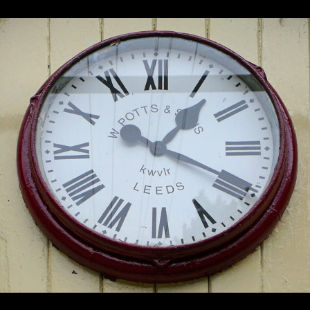

# time-wizard-bench

time-wizard-bench holds 3196 photographs of analog clocks. We cropped
each photograph to one clock. Each crop carries the hour and minute that
clock shows. The photographs come from COCO and OpenImages. The labels come from
the paper "It's About Time: Analog Clock Reading in the Wild" by Charig
Yang, Weidi Xie, and Andrew Zisserman. The dataset adds fixed test, dev,
and train splits so that anyone can compare two models on identical
photographs.

The code that built the dataset, trains on it, and scores against it
lives at
[github.com/jadidbourbaki/time-wizard](https://github.com/jadidbourbaki/time-wizard).

## Examples

Three crops from the test split with their labels.

|  |  |  |
|---|---|---|
| 3:28 | 1:20 | 1:00 |

The first two crops are typical of the sharper photographs. The third
shows the low resolution of many COCO clocks.

## Fields

| Field | Type | Meaning |
|---|---|---|
| `key` | string | Source and image id, such as `coco_000000009172` |
| `image` | image | The clock crop, 448 by 448 pixels, RGB |
| `hours` | int | Hour on the 12 hour dial, 1 to 12 |
| `minutes` | int | Minute, 0 to 59 |

A key starting with `coco_` names an image in COCO 2017. A key starting
with `openimages_` names an image in OpenImages. The part after the
underscore is the image id in the source dataset. Every crop therefore
traces back to its original photograph.

## Splits

| Split | Photographs | Purpose |
|---|---|---|
| test | 200 | Score a finished model once |
| dev | 200 | Choose hyperparameters and select checkpoints |
| train | 2796 | Fine-tune |

Each split holds COCO and OpenImages photographs in the same proportion
as the whole set, 59 percent COCO. A random draw with seed 0 assigned the
photographs. The split files in the GitHub repository record the
assignment as image ids and labels.

## Crop pipeline

The It's About Time authors found 1911 clocks in COCO photographs and
1317 in OpenImages photographs. The authors read each clock by eye and
recorded the hour and minute. The object detector CBNetV2 drew a box
around each clock. The authors published the labels and the boxes as CSV
files under the MIT licence.

The build script in the GitHub repository turns those files into this
dataset in five steps:

1. Download each photograph from COCO or OpenImages.
2. Crop the photograph to the detector box plus a margin of 20 percent of
   the box on each side. The paper crops with the same margin.
3. Pad the crop to a square with black bars and resize it to 448 pixels.
4. Drop near duplicates. A perceptual hash summarises each crop as a 64
   bit fingerprint. Two crops whose fingerprints differ in four bits or
   fewer show the same clock. The hash check removed 32 photographs.
5. Shuffle each source with seed 0. Assign 200 photographs to test, 200 to
   dev, and the remaining 2796 to train.

## Scoring

Show the model one crop and ask for the time. We fix the system prompt
and the question:

```
Reply with ONLY the requested JSON, no preface and no code block.
```

```
What time does this analog clock show? Reply as JSON: {"hours": H, "minutes": M} with H from 1 to 12.
```

Take the first JSON object in the reply as the prediction. A reply with no
JSON object counts as wrong. A prediction counts as correct when it lands
within one minute of the label on the 12 hour dial. The distance wraps at
twelve o'clock. A prediction of 12:59 against a label of 1:00 is therefore
one minute of error.

The `timewizard.reading` module in the GitHub repository holds the two
strings, the parser, and the metric. The snippet below scores any
function that maps a crop and the two prompts to a reply string:

```python
from datasets import load_dataset
from timewizard.reading import PROMPT, SYSTEM, Time, parse_time, score

rows = load_dataset("jadidbourbaki/time-wizard-bench", split="test")
predictions = [parse_time(my_model(row["image"], SYSTEM, PROMPT)) for row in rows]
truths = [Time(hours=row["hours"], minutes=row["minutes"]) for row in rows]
print(score(predictions, truths))
```

`parse_time` returns the parsed time or None. `score` returns the share
within one minute, the share exactly right, the share with the correct
hour, the mean circular error in minutes over the readable replies, and
the count of unreadable replies. The command `just bench --model <id>
--split test` in the repository runs the same procedure against any model
that pydantic-ai can reach.

The It's About Time paper computes its top-1 accuracy with the same one
minute rule. The paper's numbers on the full COCO and OpenImages sets sit
on the same scale as numbers on this test split.

## Results

GPT-5.6 Sol, Claude Fable 5.1, and Claude Opus 5 answered the 200 test
crops through their APIs. Opus 5 ran on 2026-09-03. GPT-5.6 Sol and
Fable 5.1 ran on 2026-09-04.

| Model | Effort | Within 1 min | Exact | Hour | Mean error | Unreadable |
|---|---|---|---|---|---|---|
| GPT-5.6 Sol | max | 61.5% | 31.0% | 68.5% | 65 min | 0 |
| Claude Fable 5.1 | max | 21.5% | 11.5% | 42.5% | 107 min | 2 |
| Claude Opus 5 | max | 15.5% | 6.0% | 31.0% | 141 min | 0 |

Each column reads as follows.

- **Within 1 min**, the headline metric, is the share of clocks where the
  prediction lands within one minute of the label on the 12 hour dial. The
  distance wraps at twelve. A reading of 12:59 against 1:00 is one minute
  off.
- **Exact** is the share of clocks where the prediction matches the label
  to the minute.
- **Hour** is the share of clocks where the predicted hour matches
  the labelled hour, whatever the minute.
- **Mean error** is the wrapped distance in minutes between prediction and
  label, averaged over the readable replies. The largest possible distance
  is 360 minutes.
- **Unreadable** is the count of replies with no valid time in them, such
  as a refusal or malformed JSON. An unreadable reply counts as wrong in
  the three shares above and is left out of the mean error.

Every model saw the same crops, sent as 448 pixel PNG images, with the
system prompt and question above. Each model ran at its highest reasoning
setting. The reply budget was 32000 tokens per clock, covering reasoning
and answer. We allowed each request 600 seconds and retried a failed
request up to five times. Eight requests ran at once.

| Model | API id | Provider | Input tokens | Output tokens | Cost |
|---|---|---|---|---|---|
| GPT-5.6 Sol | openai.gpt-5.6-sol | Amazon Bedrock, us-east-1 | 79,200 | 686,146 | $14.04 |
| Claude Fable 5.1 | claude-fable-5-1 | Anthropic API | 65,934 | 971,794 | $49.25 |
| Claude Opus 5 | claude-opus-5 | Anthropic API | 66,200 | 365,711 | $9.47 |

Cost multiplies the token counts by the list price on the day of the run:
$4 and $20 per million input and output tokens for GPT-5.6 Sol on
Bedrock, $10 and $50 for Fable 5.1, and $5 and $25 for Opus 5. Fable 5.1
used its whole budget on two clocks without answering. The runner records
no tokens for a failed request. The two failed requests add about 64,000
output tokens and $3.20 that the table leaves out.

The GitHub repository holds every reply in `runs/bench/` and the score
files beside them.

## Limitations

COCO clocks are small in their source photographs. The median COCO clock
spans 80 pixels. The median OpenImages clock spans 235 pixels. Four in
five COCO crops cover under 224 pixels of the source photograph before
the resize to 448. At that size one minute of arc is under a pixel wide.
No model can read those clocks to the minute.

The labels record hours and minutes only. There is no second hand label,
no AM or PM, and no flag for a clock that shows an impossible time. The
authors read the clocks by eye. Some labels therefore carry a minute or
two of error. We score every model against the same labels. Comparisons
between models therefore hold.

The photographs have been public on the internet for years. A model
trained on web data may have seen them along with nearby text. A model
trained on the train split alone has seen only those 2796 crops.

## Licence

The labels, the crop boxes, and the split assignments are MIT. The It's
About Time repository publishes its labels under MIT. time-wizard-bench
keeps that licence for everything derived from them.

The photographs keep the licence of their source. OpenImages photographs
are CC BY 2.0. The `key` field identifies each one for attribution. COCO
photographs come from Flickr under the licence each photographer chose.
COCO distributes them subject to the Flickr terms of use. Use the
photographs on the same terms as their sources.

## Citation

Cite the paper that produced the labels:

```
@inproceedings{yang2022itsabouttime,
  title     = {It's About Time: Analog Clock Reading in the Wild},
  author    = {Yang, Charig and Xie, Weidi and Zisserman, Andrew},
  booktitle = {Proceedings of the IEEE/CVF Conference on Computer Vision and Pattern Recognition},
  year      = {2022}
}
```

Cite the dataset for the splits and the scores:

```
@misc{timewizardbench2026,
  title  = {time-wizard-bench},
  author = {Tirmazi, Hayder},
  year   = {2026},
  url    = {https://huggingface.co/datasets/jadidbourbaki/time-wizard-bench}
}
```
