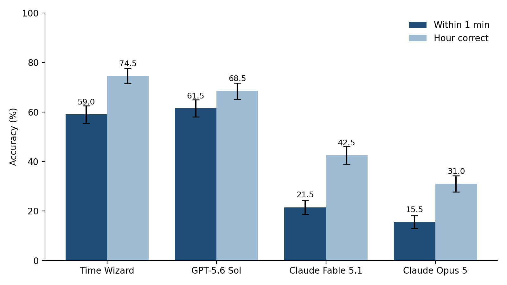
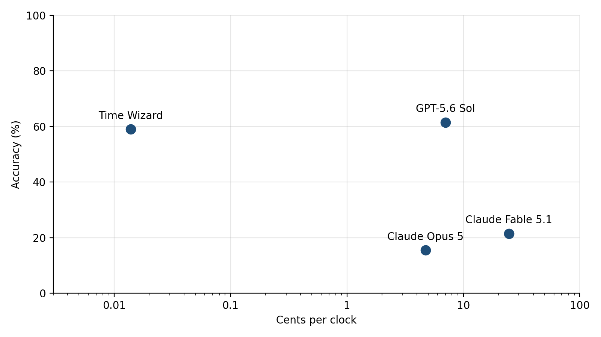

# Time Wizard

Time Wizard is a 450 million parameter vision language model that reads
the time from a photograph of an analog clock. Time Wizard answers with
the hour and the minute as JSON. On 200 held out photographs Time Wizard
matches GPT-5.6 Sol at maximum reasoning effort and beats Claude Fable
5.1 and Claude Opus 5 by a wide margin.

| Property | Value |
|---|---|
| Base model | [LFM2.5-VL-450M](https://huggingface.co/LiquidAI/LFM2.5-VL-450M) by Liquid AI |
| Parameters | 450 million |
| Training data | [time-wizard-bench](https://huggingface.co/datasets/jadidbourbaki/time-wizard-bench) train split |
| Training | full fine-tune, 142 seconds on one H100 |
| Within 1 min on the test split | 59.0% |
| Input | one photograph cropped to the clock |
| Output | `{"hours": H, "minutes": M}` |
| Licence | [LFM Open License v1.0](https://huggingface.co/LiquidAI/LFM2.5-VL-450M/blob/main/LICENSE) |

We built Time Wizard by fine-tuning Liquid AI's
[LFM2.5-VL-450M](https://huggingface.co/LiquidAI/LFM2.5-VL-450M) on 2796
labelled clock photographs. The training run took 142 seconds on one
H100. The photographs, labels, and splits are the public dataset
[time-wizard-bench](https://huggingface.co/datasets/jadidbourbaki/time-wizard-bench).
The training and scoring code is in the
[time-wizard repository](https://github.com/jadidbourbaki/time-wizard)
on GitHub.

## Results

The test split of time-wizard-bench holds 200 clock crops. No model saw
them before scoring. Every model received the same 448 pixel crop and the
same question. GPT-5.6 Sol, Claude Fable 5.1, and Claude Opus 5 ran
through their APIs at the `max` reasoning effort setting with a budget of
32000 tokens per clock. Time Wizard decodes greedily with no reasoning.

| Model | Effort | Within 1 min | Exact | Hour | Mean error | Unreadable |
|---|---|---|---|---|---|---|
| Time Wizard | none | 59.0% | 31.0% | 74.5% | 44 min | 0 |
| GPT-5.6 Sol | max | 61.5% | 31.0% | 68.5% | 65 min | 0 |
| Claude Fable 5.1 | max | 21.5% | 11.5% | 42.5% | 107 min | 2 |
| Claude Opus 5 | max | 15.5% | 6.0% | 31.0% | 141 min | 0 |



Accuracy in the figure is the share of the 200 test clocks each model
read correctly. The dark bars count a reading as correct within one
minute of the label. The light bars count a reading as correct when the
hour matches. The error bars extend one standard error above and below
each share. The standard error is the amount a share would typically
move if we drew a fresh 200 clocks from the same pool. Near 60 percent it
is about 3.5 points. Two bars whose error bars overlap are within noise
of each other.

Within 1 min is the share of clocks read to within one minute on the 12
hour dial. The distance wraps at twelve. Exact is the share read to the
minute. Hour is the share with the right hour. Mean error averages the
wrapped distance in minutes over readable replies. Unreadable counts
replies with no valid time in them. Fable 5.1 used its whole token
budget on two clocks without answering. The
[time-wizard-bench card](https://huggingface.co/datasets/jadidbourbaki/time-wizard-bench)
gives the prompt, the scoring code, and the full configuration of each
frontier model.

With 200 photographs the standard error near 60 percent is about 3.5
points. Time Wizard and GPT-5.6 Sol are within sampling error of each
other on the one minute metric. Time Wizard leads on the hour and on mean
error. Time Wizard leads Fable 5.1 by 38 points and Opus 5 by 44 points
on the one minute metric.

## Three test clocks

| Tower clock | Station clock | Blurred clock |
|---|---|---|
|  |  |  |

| Model | Effort | Tower clock | Station clock | Blurred clock |
|---|---|---|---|---|
| Label | | 3:28 | 1:20 | 1:00 |
| Time Wizard | none | 3:28 | 1:20 | 8:20 |
| GPT-5.6 Sol | max | 3:28 | 10:07 | 6:00 |
| Claude Fable 5.1 | max | 4:25 | 1:23 | 7:55 |
| Claude Opus 5 | max | 4:28 | 10:22 | 7:10 |

The tower clock and the station clock are sharp. Time Wizard reads both
to the minute. GPT-5.6 Sol and Opus 5 swap the hour and minute hands on
the station clock. The blurred clock covers a few dozen pixels in the
source photograph. Every model guesses wrong on it.

## Perception and reasoning

Reading an analog clock means judging the angle of two hands. One minute
moves the minute hand six degrees. Reading to the minute therefore means
resolving angles to six degrees. GPT-5.6 Sol, Fable 5.1, and Opus 5
approach the task by reasoning. They describe the hands in words,
estimate the angles, check which hand is longer, and verify the
arithmetic. Each clock costs them thousands of tokens. The answers
still land far from the label. Opus 5 misses by 141 minutes on average.
A random guess would miss by 180.

Time Wizard reads the clock in one forward pass. The vision encoder of
Time Wizard learned from 2796 labelled examples to carry the angle of
each hand through to the language model. The language model turns the
angles into a time. Time Wizard has 450 million parameters. Training it
cost about fifteen cents of GPU time. On this task that is enough to
match GPT-5.6 Sol.

The price gap at inference is large. We priced each API model's run by
multiplying the input and output tokens it consumed by the list prices
on the day, then dividing by the 200 clocks. GPT-5.6 Sol spent 686,146
output tokens on the 200 clocks. At its list price that is $14.04, or 7
cents a clock. Fable 5.1 spent 971,794 output tokens for $49.25, or 25
cents a clock. Opus 5 cost 4.7 cents a clock. We priced Time Wizard by
its GPU time. Time Wizard read the 200 clocks in 26 seconds on one H100
that rents for $3.85 an hour on Nebius. The GPU time comes to 0.014 cents
a clock.



Accuracy in the figure is the share of the 200 test clocks read within
one minute of the label. The cost axis is the price per clock computed
above, on a log scale because the four prices span three orders of
magnitude.

## Usage

The time-wizard repository provides a reader. Clone it, run `just setup`,
then run:

```
just read clock.jpg
```

The reader downloads Time Wizard from the Hub and prints the time it
reads, such as `{"hours":3,"minutes":28}`. Crop the photograph to the
clock first. In Python, `Reader` loads Time Wizard once and reads many
photographs:

```python
from PIL import Image
from timewizard.reader import Reader

reader = Reader()
time = reader.read(Image.open("clock.jpg"))
print(time.hours, time.minutes)
```

`read` returns None when the reply holds no valid time. `Reader` pads the
image to a square and resizes it to 448 pixels, the shape Time Wizard
trained on.

To use the weights without the time-wizard repository, send one image and
the fixed prompt through transformers:

```python
import torch
from transformers import AutoModelForImageTextToText, AutoProcessor
from PIL import Image, ImageOps

SYSTEM = "Reply with ONLY the requested JSON, no preface and no code block."
PROMPT = 'What time does this analog clock show? Reply as JSON: {"hours": H, "minutes": M} with H from 1 to 12.'

processor = AutoProcessor.from_pretrained("jadidbourbaki/time-wizard", max_image_tokens=256)
model = AutoModelForImageTextToText.from_pretrained("jadidbourbaki/time-wizard", dtype=torch.bfloat16)

image = ImageOps.pad(Image.open("clock.jpg").convert("RGB"), (448, 448), color=(0, 0, 0))
messages = [
    {"role": "system", "content": [{"type": "text", "text": SYSTEM}]},
    {"role": "user", "content": [{"type": "image", "image": image}, {"type": "text", "text": PROMPT}]},
]
inputs = processor.apply_chat_template(
    messages, add_generation_prompt=True, tokenize=True, return_dict=True, return_tensors="pt"
)
out = model.generate(**inputs, max_new_tokens=32, do_sample=False)
print(processor.batch_decode(out[:, inputs["input_ids"].shape[1] :], skip_special_tokens=True)[0])
```

The system prompt and the question must match the strings above.
Time Wizard saw only those strings during training. `max_image_tokens=256`
is the image budget we trained with. A 448 pixel square occupies 196
image tokens under it. Greedy decoding with 32 new tokens is enough for
the JSON reply.

## Training

We fine-tuned every weight of LFM2.5-VL-450M on the 2796 photograph
train split of time-wizard-bench. Each photograph is a crop around one
clock with a human label for the hour and the minute. We turned each
photograph into one conversation: the system prompt, the image with the
question, and the label as the JSON reply. We then trained
LFM2.5-VL-450M to predict the reply.

We used supervised fine-tuning with TRL's SFTTrainer. LFM2.5-VL-450M
predicts each token of the reply. We penalise wrong predictions with
cross entropy. We mask the system prompt, the image, and the question out
of the loss. LFM2.5-VL-450M therefore spends its capacity on producing
the time.

We trained the vision encoder along with the language model. The encoder
has to change. Reading a clock requires the encoder to carry the angle of
each hand through to the language model. A low rank adapter would have
frozen the encoder. LFM2.5-VL-450M fits on one GPU with room to spare.
Full fine-tuning therefore costs nothing extra.

We used AdamW with a peak learning rate of 5e-5. We warmed the rate up
over the first three percent of steps and decayed it with a cosine
schedule. Each step saw 32 photographs as two accumulated batches of 16.
We trained for five epochs in bfloat16 with seed 0. Five epochs take
about 440 steps. After every epoch we measured loss on the 200 photograph
dev split of time-wizard-bench. We kept the epoch with the lowest dev
loss. Epoch three reached the minimum of 0.249. The weights published
here are the weights saved at the end of epoch three. Epochs four and
five ran to completion. The epoch four and five checkpoints had a higher
dev loss. We discarded them.

We chose the learning rate and the number of epochs from a sweep scored
on the dev split. The rate mattered a great deal. At 2e-5 the fine-tune
reached 28 percent within one minute after three epochs and 38 percent
after five. At 5e-5 over three epochs the fine-tune collapsed to 1.5
percent. The same rate over five epochs reached 60.5 percent. The longer schedule
stretches the warmup and slows the decay. The longer schedule is what
makes the higher rate usable. Dev loss tracked the dev score across
every run. The lowest dev loss therefore picked the best fine-tune
without touching the test split. Two seeds at the same setting landed
half a point apart. The differences above are real.

The final run took 142 seconds on one H100 on Nebius. At the hourly
price of that machine the run cost about fifteen cents. The whole sweep
of seven runs took under twenty minutes of GPU time.

## Limitations

Time Wizard reads a clock that fills most of the image. Time Wizard has
seen only crops with a margin of one fifth of the clock's width on each
side. A
whole scene with a small clock in it needs a detector or a manual crop
first.

Many photographs cannot be read to the minute by anyone. Four in five
COCO clocks cover under 224 pixels of the source photograph. At that size
one minute of arc is under a pixel wide. On such clocks Time Wizard gets
the hour right more often than the minute.

The dial gives no AM or PM. The hour is always between 1 and 12. A clock
with no minute hand, a digital clock, or a stopped clock all produce a
confident answer that may be wrong. We trained and evaluated on
photographs of real clocks. We did not test drawings or rendered clocks.

The headline number rests on 200 photographs. A difference of a few
points between two models on this test split is within noise.

## Licence

Liquid AI releases LFM2.5-VL-450M under the
[LFM Open License v1.0](https://huggingface.co/LiquidAI/LFM2.5-VL-450M/blob/main/LICENSE).
Time Wizard is a fine-tune of LFM2.5-VL-450M and carries the same
licence. Read the licence before use.

## Citation

```
@misc{timewizard2026,
  title  = {Time Wizard: A 450M Analog Clock Reading Model},
  author = {Tirmazi, Hayder},
  year   = {2026},
  url    = {https://huggingface.co/jadidbourbaki/time-wizard}
}
```
